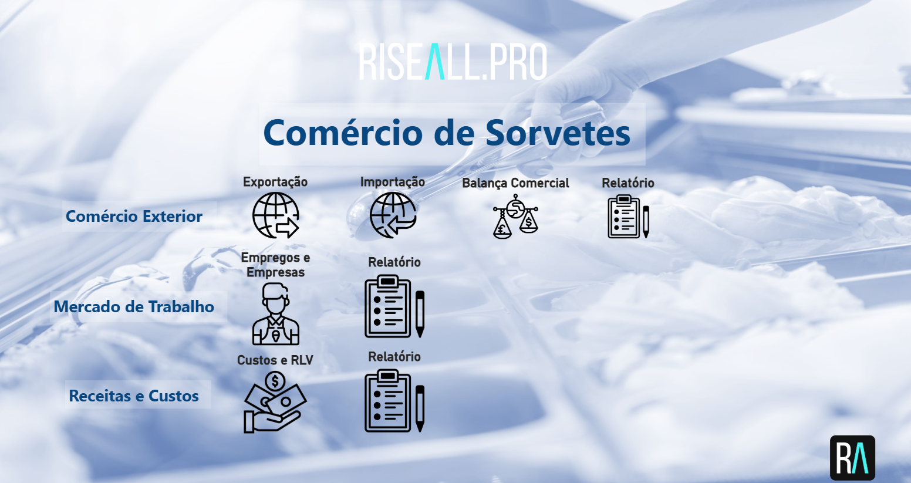
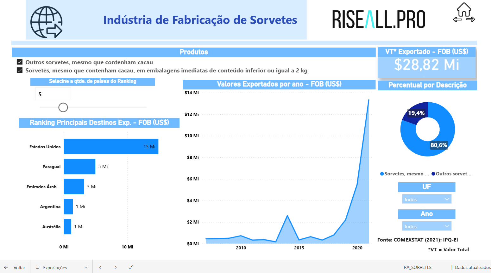
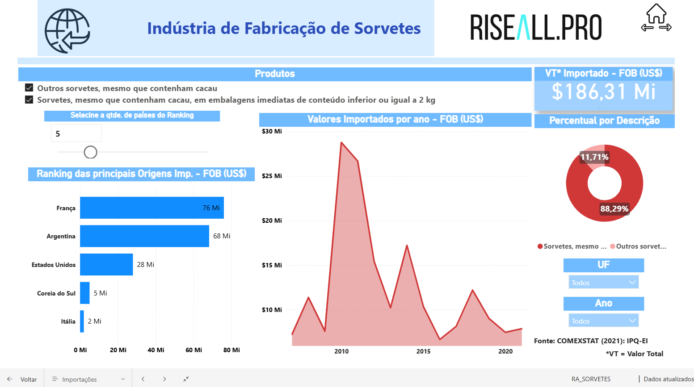
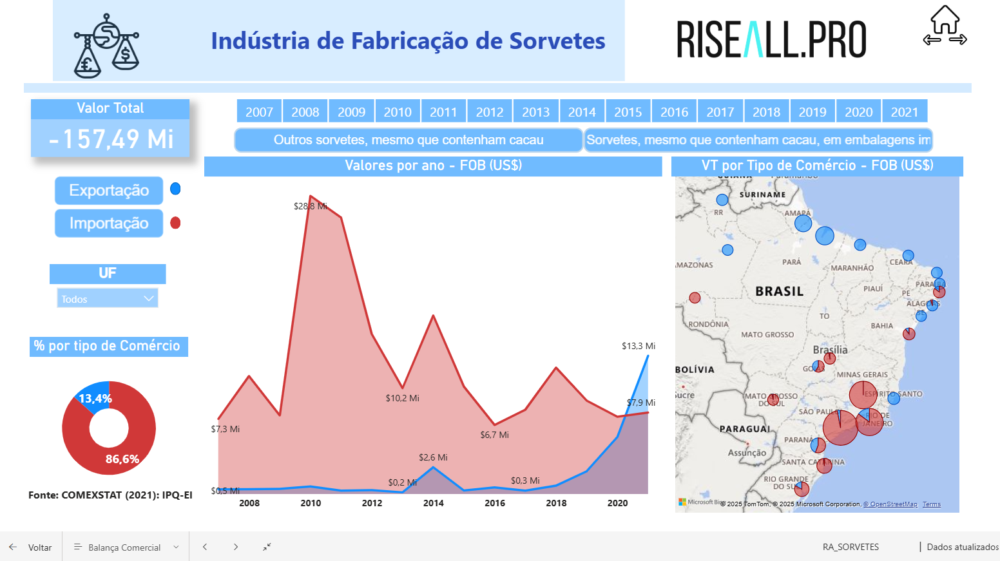
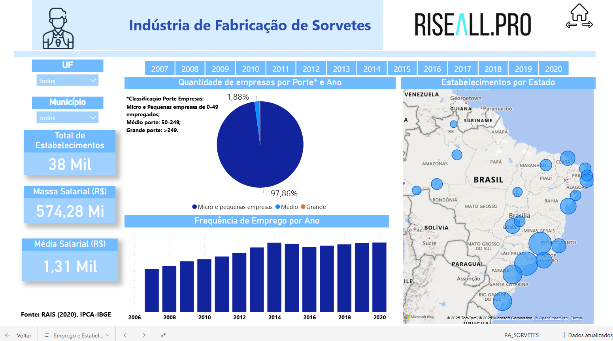
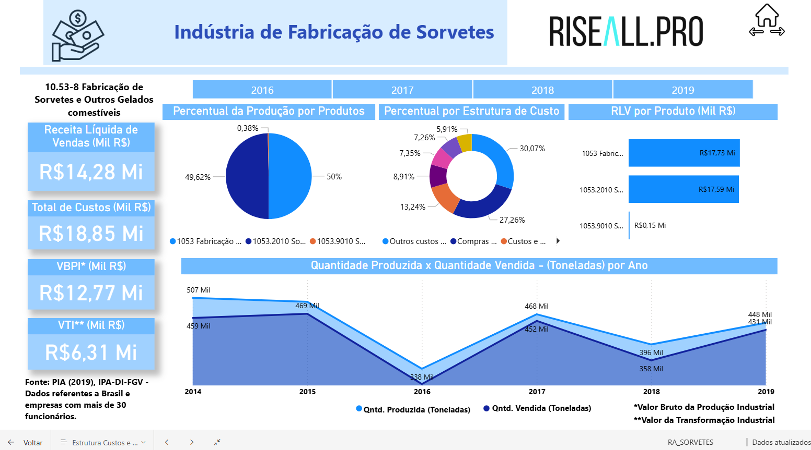

# 🍦 Dashboard – Indústria de Fabricação de Sorvetes

Este repositório contém um projeto em **Power BI** voltado para a análise da **indústria de fabricação de sorvetes no Brasil**, com foco em **comércio exterior, mercado de trabalho, receitas e custos**.

O painel consolida informações de exportações, importações, balança comercial, emprego formal, estabelecimentos e estrutura de custos, permitindo uma visão interativa e detalhada do setor.

---

## 🔎 Funcionalidades

* **Comércio Exterior**

  * Exportações totais: **US\$ 28,82 milhões**.
  * Importações totais: **US\$ 186,31 milhões**.
  * Saldo da balança comercial: **–US\$ 157,49 milhões**.
  * Ranking dos principais destinos das exportações (EUA, Paraguai, Emirados Árabes, Argentina, Austrália).
  * Ranking dos principais fornecedores de importações (França, Argentina, EUA, Coreia do Sul, Itália).
  * Séries históricas de valores exportados e importados por ano.
  * Distribuição geográfica dos municípios envolvidos no comércio.

* **Relatórios de Comércio Exterior**

  * Tabelas detalhadas com valores FOB, taxas de crescimento e saldo por tipo de produto.

* **Mercado de Trabalho**

  * **38 mil estabelecimentos** no setor.
  * Massa salarial de **R\$ 574,28 milhões**.
  * Média salarial de **R\$ 1,31 mil**.
  * Frequência de empregos formais por ano (2007–2020).
  * Distribuição de empresas por porte: micro/pequenas (97,9%), médias (1,9%) e grandes (0,2%).

* **Receitas e Custos**

  * Receita líquida de vendas (RLV): **R\$ 14,28 milhões**.
  * Custos totais: **R\$ 18,85 milhões**.
  * Valor Bruto da Produção Industrial (VBPI): **R\$ 12,77 milhões**.
  * Valor da Transformação Industrial (VTI): **R\$ 6,31 milhões**.
  * Estrutura detalhada de custos (matérias-primas, despesas de pessoal, etc.).
  * Produção x vendas em toneladas (2014–2019).

---

## 📈 Principais Indicadores

* **Exportações:** US\$ 28,82 milhões.
* **Importações:** US\$ 186,31 milhões.
* **Saldo Comercial:** –US\$ 157,49 milhões.
* **Estabelecimentos:** 38 mil.
* **Massa Salarial:** R\$ 574,28 milhões.
* **Média Salarial:** R\$ 1,31 mil.
* **RLV Total:** R\$ 14,28 milhões.
* **Custos Totais:** R\$ 18,85 milhões.

---

## 🖼️ Imagens do Dashboard

### Visão Geral

### Exportações

### Importações

### Balança Comercial

### Relatório de Comércio Exterior

### Empregos e Estabelecimentos

### Relatório de Emprego e Empresas

### Estrutura de Custos e Receitas

### Relatório Estrutura de Custos

---

## 🚀 Tecnologias Utilizadas

* **Power BI** – Modelagem, análise e visualização de dados.
* **Bases de Dados:** COMEXSTAT (2021), RAIS (2020), PIA (2019), IPCA-IBGE, IPA-DI-FGV.

---

## 📌 Objetivo

O projeto busca fornecer uma **análise abrangente da indústria de fabricação de sorvetes no Brasil**, unindo dados de comércio internacional, emprego e custos industriais, para apoiar decisões estratégicas e estudos setoriais.

